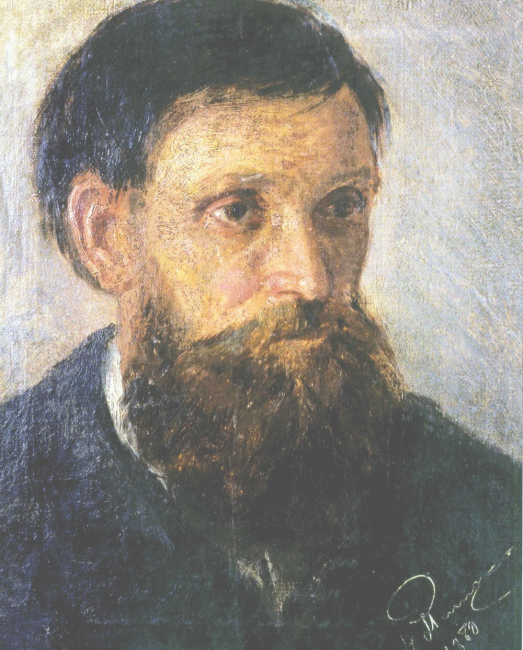

The purpose of this project is to create a website to promote the work of MYKOLA PYMONENKO, in collaboration with UX/UI Design by Mintleaf, to share knowledge about the artist and his works.

### Project Benefits
This project aims to increase awareness about the artist MYKOLA PYMONENKO and his contributions, while also providing a platform to practice teamwork and web development skills.

### How the Project Works
The project involves developing a website using Node.js with a design inspired by Discord, integrating content about the artist's life and works.

# The purpose of the project
 Site about **"MYKOLA PYMONENKO (1862 - 1912)"**, created for the acquisition of teamwork skills, web design and site development from the Figma platform

# Who is **MYKOLA PYMONENKO**



Ukrainian painter, academician of painting at the St. Petersburg Academy of Arts, member of the Paris International Union of Arts and Letters, author of many paintings on rural and urban themes.

# Used of technology

- HyperText Markup Language ( html )
- Cascading Style Sheets ( css )
- JavaScript ( js )
- Figma ( [figma.com](https://figma.com/) )

# Development team

- UX/UI Design : [**Mintleaf**]()
- Front-End Development : [**Fulldroper**](https://fulldroper.cf/)

# The result of the work carried out

> Site: https://fulldroper.github.io/MYKOLA-PYMONENKO/

> Code Repository: https://github.com/Fulldroper/MYKOLA-PYMONENKO.git

### Repository and Installation
[GitHub Repository](https://github.com/Fulldroper/MYKOLA-PYMONENKO)

To install and run the project:

1. Clone the repository:
    ```bash
    git clone https://github.com/Fulldroper/MYKOLA-PYMONENKO
    cd MYKOLA-PYMONENKO
    ```

2. Install dependencies and start the server:
    ```bash
    npm install
    npm start
    ```

### Project Workflow
1. **Setup Project:** Initialize the project structure and dependencies.
    ```bash
    npm init
    npm install
    ```

2. **Develop Pages and Components:** Create the main pages and components of the website.
    ```html
    <!DOCTYPE html>
    <html>
    <head>
        <title>MYKOLA PYMONENKO</title>
    </head>
    <body>
        <h1>Welcome to the MYKOLA PYMONENKO Website</h1>
    </body>
    </html>
    ```

3. **Style and Design:** Apply styles and design elements as per the UX/UI design from Mintleaf.
    ```css
    body {
        font-family: Arial, sans-serif;
        background-color: #f0f0f0;
        color: #333;
    }
    ```

### Skills Gained
- Developing websites using Node.js
- Collaborating with UX/UI designers
- Implementing designs from Figma into functional web pages
