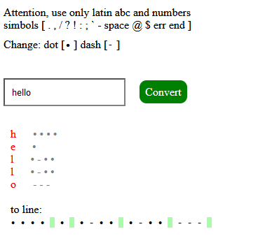

The purpose of this project is to create a web page for translating text to Morse code, allowing users to replace the dot and dash characters with any symbol of their choice.

Morse code is a method used in telecommunication to encode text characters as standardized sequences of two different signal durations, called dots and dashes or dits and dahs. Morse code is named after Samuel Morse, an inventor of the telegraph.There is no distinction between upper and lower case letters. Each Morse code symbol is formed by a sequence of dots and dashes. The dot duration is the basic unit of time measurement in Morse code transmission. The duration of a dash is three times the duration of a dot. In an emergency, Morse code can be generated by improvised methods such as turning a light on and off, tapping on an object or sounding a horn or whistle, making it one of the simplest and most versatile methods of telecommunication. The most common distress signal is SOS – three dots, three dashes, and three dots – internationally recognized by treaty.

### Project Benefits
This project is useful for learning about Morse code and for experimenting with custom symbol replacements in encoding text.

### How the Project Works
The project provides a web interface where users can input text, select custom symbols for dots and dashes, and see the corresponding Morse code output.

### An example of the result of the algorithm


> [try it](https://fulldroper.github.io/Morze/).

### Repository and Installation
[GitHub Repository](https://github.com/Fulldroper/Morze)

To use the project:

1. Clone the repository:
    ```bash
    git clone https://github.com/Fulldroper/Morze
    cd Morze
    ```

2. Open `index.html` in a web browser.

### Project Workflow
1. **HTML Structure:** Create the basic structure of the web page.
    ```html
    <!DOCTYPE html>
    <html>
    <head>
        <title>Morze Code Translator</title>
    </head>
    <body>
        <input type="text" id="textInput" placeholder="Enter text">
        <input type="text" id="dotSymbol" placeholder="Dot symbol">
        <input type="text" id="dashSymbol" placeholder="Dash symbol">
        <button onclick="translateToMorze()">Translate</button>
        <div id="output"></div>
    </body>
    </html>
    ```

2. **JavaScript Logic:** Implement the translation logic.
    ```javascript
    function translateToMorze() {
        const text = document.getElementById('textInput').value;
        const dot = document.getElementById('dotSymbol').value || '.';
        const dash = document.getElementById('dashSymbol').value || '-';
        const morzeCode = text.split('').map(char => {
            // Simple mapping for demonstration
            return char === 'a' ? dot + dash : char;
        }).join(' ');
        document.getElementById('output').innerText = morzeCode;
    }
    ```

### Skills Gained
- Creating interactive web pages with HTML and JavaScript
- Understanding and implementing Morse code translation
- Handling user input and dynamic content updates
