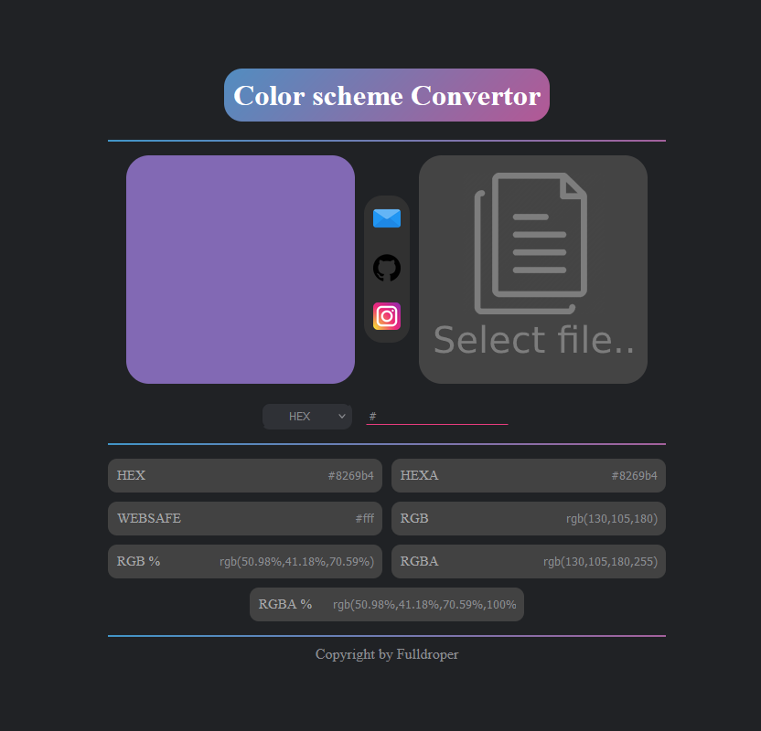

The goal of this project was to create a website for quick conversion between various color systems (HEX, HEXA, RGB, RGBA, WEBSAFE, RGB %, RGBA %, and color from an image).

## Project Benefits
This project is useful for designers and developers who need a quick and reliable tool for converting between different color formats.


## Project Description
This web tool allows users to input a color in one format and instantly see its equivalent in other formats. It also provides the functionality to extract a color from an uploaded image.

## Repository Link and Installation Example
Repository: [Color Convertor](https://github.com/Fulldroper/color-convertor/)
Website: [Color Convertor](https://fulldroper.github.io/color-convertor/)

### Installation
Clone the repository and install the dependencies:

```bash
git clone https://github.com/Fulldroper/color-convertor/
cd color-convertor
npm install
```

### Usage
Start the development server:

```bash
npm start
```

Access the tool via the local server URL provided in the terminal output.

## Project Workflow
1. **Input Color**: Users can input a color in various formats like HEX, RGB, etc.
    ```javascript
    // Example of input handling
    function handleColorInput(input) {
        const color = convertToColorObject(input);
        updateDisplay(color);
    }
    ```

2. **Convert Color**: The tool converts the input color to all supported formats.
    ```javascript
    // Example of color conversion
    function convertToColorObject(input) {
        // Conversion logic here
        return {
            hex: toHex(input),
            rgb: toRgb(input),
            // Other formats
        };
    }
    ```

3. **Display Results**: The converted colors are displayed to the user.
    ```javascript
    // Example of updating the display
    function updateDisplay(color) {
        document.getElementById('hex').textContent = color.hex;
        document.getElementById('rgb').textContent = color.rgb;
        // Other formats
    }
    ```

## Skills Acquired
- Proficiency in JavaScript
- Understanding of color conversion algorithms
- Experience with frontend web development
- Handling user input and dynamic content updates
