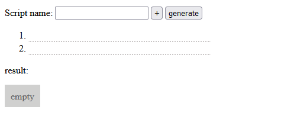

The purpose of this project is to create a website that allows users to generate looped scripts for the Source game engine using a single button to bind commands, simplifying gameplay.

### Project Benefits
This project simplifies the creation of game scripts, making it easier for players to enhance their gameplay experience without extensive scripting knowledge.

### How the Project Works
The project provides a web interface where users can input script parameters, and generate a looped script that can be bound to a single key for use in the Source game engine.

### An example of the result of the algorithm

> [try it](https://fulldroper.github.io/rp-scripter/).

### Repository and Installation
[GitHub Repository](https://github.com/Fulldroper/rp-scripter)

To use the project:

1. Clone the repository:
    ```bash
    git clone https://github.com/Fulldroper/rp-scripter
    cd rp-scripter
    ```

2. Install dependencies and start the server:
    ```bash
    npm install
    npm start
    ```

### Project Workflow
1. **Setup Project:** Initialize the project structure and dependencies.
    ```bash
    npm init
    npm install
    ```

2. **Develop the Web Interface:** Create the HTML structure and form for script input.
    ```html
    <!DOCTYPE html>
    <html>
    <head>
        <title>RP Scripter</title>
    </head>
    <body>
        <h1>RP Scripter</h1>
        <input type="text" id="command" placeholder="Enter command">
        <button onclick="generateScript()">Generate Script</button>
        <pre id="scriptOutput"></pre>
    </body>
    </html>
    ```

3. **Script Generation Logic:** Implement the JavaScript to generate looped scripts.
    ```javascript
    function generateScript() {
        const command = document.getElementById('command').value;
        const script = 'alias +loop "${command}"
        alias -loop "echo Loop stopped"
        bind KEY +loop';
        document.getElementById('scriptOutput').innerText = script;
    }
    ```

### Skills Gained
- Developing web interfaces with HTML, CSS, and JavaScript
- Understanding game scripting for the Source engine
- Simplifying complex scripting tasks for end-users
