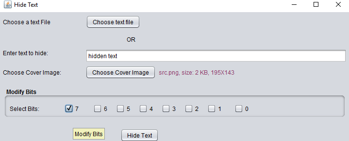
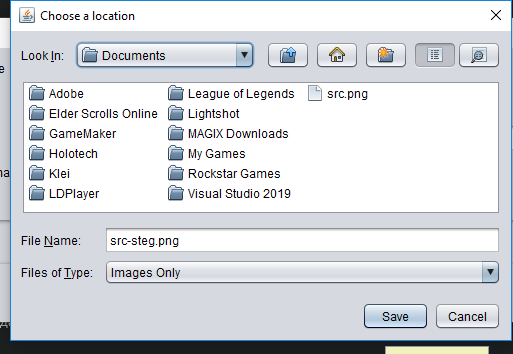
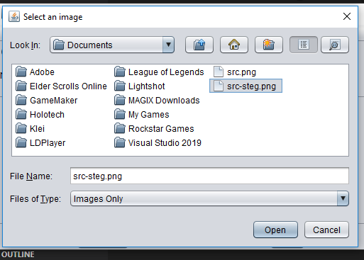
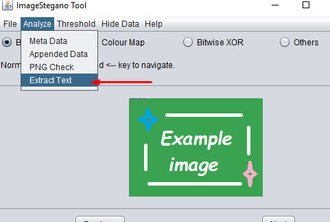

The purpose of this project is to implement steganography techniques in Java, allowing for the hiding of data within images.

### Project Benefits
This project is useful for learning and experimenting with steganography, particularly in understanding how data can be hidden and detected within image files.

### How the Project Works
The project includes methods for hiding data using the Least Significant Bit (LSB) technique and analyzing hidden data using steganalysis methods like the Chi-square attack.
1. ### Selecting and opening a file: 
   
2. ### Adding "hidden text": 
   
3. ### Saving a file with modified data: 
   
4. ### Selecting and opening a file with modified data: 
   
5. ### Search for hidden text in a modified data file: 
   

### Repository and Installation
[GitHub Repository](https://github.com/Fulldroper/stegonography)

To use the project:

1. Clone the repository:
    ```bash
    git clone https://github.com/Fulldroper/stegonography
    cd stegonography
    ```

2. Compile and run the Java application:
    ```bash
    javac Steganography.java
    java Steganography
    ```

### Project Workflow
1. **File Selection:** Choose and open the image file.
    ```java
    BufferedImage image = ImageIO.read(new File("path/to/image"));
    ```

2. **Data Hiding:** Embed secret text into the image using LSB.
    ```java
    byte[] imageBytes = ((DataBufferByte) image.getRaster().getDataBuffer()).getData();
    // Embed data
    ```

3. **Data Extraction:** Retrieve hidden text from the modified image.
    ```java
    // Extract data from imageBytes
    String hiddenText = extractHiddenText(imageBytes);
    ```

### Skills Gained
- Implementing steganography techniques in Java
- Understanding data hiding and extraction methods
- Analyzing hidden data using steganalysis
